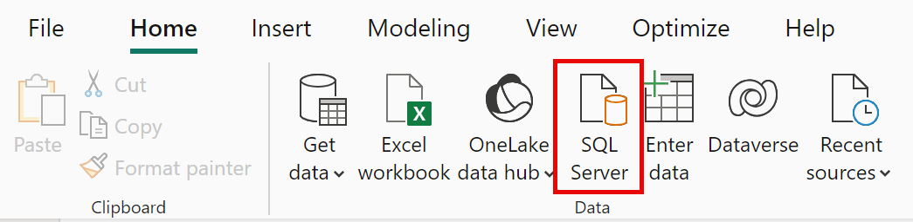
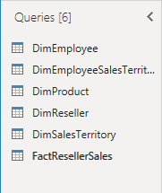
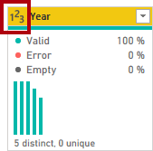

Voici la traduction :

---

```
lab:
    title: 'Obtenir des données dans Power BI Desktop'
    module: 'Obtenir des données dans Power BI'
```

# Obtenir des données dans Power BI Desktop

## **Présentation du lab**

Ce lab est conçu pour vous familiariser avec l'application Power BI Desktop, pour vous apprendre à vous connecter aux données et à utiliser des techniques de prévisualisation pour comprendre les caractéristiques et la qualité des données sources. Les objectifs d'apprentissage sont :

- Ouvrir Power BI Desktop
- Se connecter à différentes sources de données
- Prévisualiser les données sources avec Power Query
- Utiliser les fonctionnalités de profilage des données dans Power Query

**Ce lab devrait prendre environ 30 minutes.**

## Démarrer avec Power BI Desktop

Pour réaliser cet exercice, ouvrez un navigateur Web et entrez l'URL suivante pour télécharger le dossier zip :

`https://github.com/utopios/formationpowerbi/labs/01-prepare-data.zip`

Extrayez le dossier dans le dossier **C:\Users\Student\Downloads\01-prepare-data**.

Ouvrez le fichier **01-Starter-Sales Analysis.pbix**.

- Ce fichier de démarrage est spécialement configuré pour vous aider à compléter le lab. Les paramètres suivants au niveau du rapport ont été désactivés dans le fichier de démarrage :

  - Chargement de données > Importer les relations des sources de données lors du premier chargement
  - Chargement de données > Détecter automatiquement les nouvelles relations après le chargement des données

## Obtenir des données depuis SQL Server

Cette tâche vous apprend à vous connecter à une base de données SQL Server et à importer des tables, ce qui crée des requêtes dans Power Query.

1. Dans l'onglet **Accueil** du ruban, dans le groupe **Données**, sélectionnez **SQL Server**.

     

1. Dans la fenêtre **Base de données SQL Server**, dans la case **Serveur**, entrez **localhost** et laissez la case **Base de données** vide, puis sélectionnez **OK**.

    > ***Remarque** : Dans ce lab, vous vous connecterez à la base de données SQL Server en utilisant **localhost** car les sources de données de la passerelle ne peuvent pas résoudre **localhost**. Cela n'est pas recommandé pour vos propres solutions.*

1. Si des informations d'identification sont demandées, sélectionnez **Windows > Utiliser mes informations d'identification actuelles**, puis **Se connecter**.

1. Sélectionnez **OK** si vous recevez un avertissement qu'une connexion chiffrée ne peut être établie.

1. Dans le volet **Navigateur**, développez la base de données **AdventureWorksDW2020**.

    > ***Remarque** : La base de données **AdventureWorksDW2020** est basée sur l'exemple de base de données **AdventureWorksDW2017**. Elle a été modifiée pour soutenir les objectifs d'apprentissage des labs du cours.*

1. Sélectionnez la table **DimEmployee**, et notez l'aperçu des données de la table.

     

    > ***Remarque** : L'aperçu des données vous permet de voir les colonnes et un échantillon de lignes.*

1. Pour importer les données de la table, **cochez la case** à côté des tables suivantes :

    - DimEmployee
    - DimEmployeeSalesTerritory
    - DimProduct
    - DimReseller
    - DimSalesTerritory
    - FactResellerSales

1. Complétez cette tâche en sélectionnant **Transformer les données**, ce qui ouvrira Power Query Editor - laissez cette fenêtre ouverte pour la tâche suivante.

Vous vous êtes maintenant connecté à six tables depuis une base de données SQL Server.

## **Prévisualiser les données dans Power Query Editor**

Cette tâche introduit Power Query Editor et vous permet de passer en revue et de profiler les données. Cela vous aide à déterminer comment nettoyer et transformer les données plus tard. Vous examinerez également les tables de dimensions (précédées de "Dim") et les tables de faits (précédées de "Fact").

1. Dans la fenêtre **Power Query Editor**, à gauche, observez le volet **Requêtes**. Ce volet contient une requête pour chaque table que vous avez sélectionnée.

     

1. Sélectionnez la première requête—**DimEmployee**.

    > *La table **DimEmployee** dans la base de données SQL Server stocke une ligne pour chaque employé. Un sous-ensemble des lignes de cette table représente les commerciaux, ce qui sera pertinent pour le modèle que vous développerez.*

1. En bas à gauche de la barre de statut, des statistiques sur la table sont fournies—la table contient 33 colonnes et 296 lignes.

     

1. Dans le volet de prévisualisation des données, faites défiler horizontalement pour examiner toutes les colonnes. Notez que les cinq dernières colonnes contiennent des liens **Table** ou **Valeur**.

    > *Ces cinq colonnes représentent des relations avec d'autres tables de la base de données. Elles peuvent être utilisées pour joindre des tables entre elles. Vous joindrez des tables dans le lab **Charger les données transformées dans Power BI Desktop**.*

1. Pour évaluer la qualité des colonnes, dans l'onglet **Affichage** du ruban, dans le groupe **Aperçu des données**, cochez **Qualité des colonnes**. La fonctionnalité de qualité des colonnes vous permet de déterminer facilement le pourcentage de valeurs valides, d'erreurs ou vides dans les colonnes.

     

1. Remarquez que la colonne **Position** contient 94% de lignes vides (nulles).

     

1. Pour évaluer la distribution des colonnes, dans l'onglet **Affichage** du ruban, dans le groupe **Aperçu des données**, cochez **Distribution des colonnes**.

1. Examinez de nouveau la colonne **Position**, et remarquez qu'il y a quatre valeurs distinctes et une valeur unique.

1. Examinez la distribution des valeurs de la colonne **EmployeeKey**—il y a 296 valeurs distinctes et 296 valeurs uniques.

     

    > ***Remarque** : Quand les comptes distincts et uniques sont identiques, cela signifie que la colonne contient des valeurs uniques. Lors de la modélisation, il est important que certaines tables de modèles contiennent des colonnes uniques. Ces colonnes uniques peuvent être utilisées pour créer des relations de type un-à-plusieurs, que vous ferez dans le lab **Modéliser les données dans Power BI Desktop**.*

1. Dans le volet **Requêtes**, sélectionnez la requête **DimProduct**.

    > *La table **DimProduct** contient une ligne par produit vendu par l'entreprise.*

1. Dans le volet **Requêtes**, sélectionnez la requête **DimReseller**.

    > *La table **DimReseller** contient une ligne par revendeur. Les revendeurs vendent, distribuent ou ajoutent de la valeur aux produits Adventure Works.*

1. Pour voir les valeurs des colonnes, dans l'onglet **Affichage** du ruban, dans le groupe **Aperçu des données**, cochez **Profil des colonnes**.

1. Sélectionnez l'en-tête de la colonne **BusinessType**, et observez le nouveau volet sous le volet de prévisualisation des données. Passez en revue les statistiques de la colonne et la distribution des valeurs dans le volet de prévisualisation des données.

    > *Remarquez le problème de qualité des données : il y a deux étiquettes pour entrepôt (**Warehouse** et **Ware House**, mal orthographié).* 

     

1. Passez la souris sur la barre **Ware House**, et notez qu'il y a cinq lignes avec cette valeur.

1. Dans le volet **Requêtes**, sélectionnez la requête **DimSalesTerritory**.  

    > *La table **DimSalesTerritory** contient une ligne par région de vente, y compris le **Corporate HQ** (siège social). Les régions sont assignées à un pays, et les pays sont assignés à des groupes. Dans le lab **Modéliser les données dans Power BI Desktop**, vous cré

erez une hiérarchie pour supporter l'analyse au niveau région, pays ou groupe.*

1. Dans le volet **Requêtes**, sélectionnez la requête **FactResellerSales**.

    > *La table **FactResellerSales** contient une ligne par ligne de commande de vente - une commande de vente contient un ou plusieurs articles.*

1. Passez en revue la qualité des colonnes pour la colonne **TotalProductCost**, et notez que 8% des lignes sont vides.

    > *Les valeurs manquantes dans la colonne **TotalProductCost** posent un problème de qualité des données.*

## **Obtenir des données d'un fichier CSV**

Dans cette tâche, vous allez créer une nouvelle requête basée sur des fichiers CSV.

1. Pour ajouter une nouvelle requête, dans la fenêtre **Power Query Editor**, dans l'onglet **Accueil** du ruban, dans le groupe **Nouvelle requête**, sélectionnez la flèche vers le bas de **Nouvelle source**, puis sélectionnez **Texte/CSV**.

1. Naviguez jusqu'au fichier **01-prepare-data > ResellerSalesTargets.csv**. Sélectionnez **Ouvrir**.

1. Dans la fenêtre **ResellerSalesTargets.csv**, passez en revue l'aperçu des données. Sélectionnez **OK**.

1. Dans le volet **Requêtes**, remarquez l'ajout de la requête **ResellerSalesTargets**.

    > *Le fichier CSV **ResellerSalesTargets** contient une ligne par commercial, par année. Chaque ligne enregistre 12 objectifs de vente mensuels (exprimés en milliers). L'année fiscale de l'entreprise Adventure Works commence le 1er juillet.*

1. Remarquez qu'aucune colonne ne contient de valeurs vides. Quand il n'y a pas d'objectif de vente mensuel, un tiret est utilisé à la place.

1. Passez en revue les icônes dans chaque en-tête de colonne, à gauche du nom de la colonne. Les icônes représentent le type de données de la colonne. **123** représente un nombre entier, et **ABC** représente du texte.

     

1. Répétez les étapes pour créer une requête basée sur le fichier **ColorFormats.csv**.

    > *Le fichier CSV **ColorFormats** contient une ligne par couleur de produit. Chaque ligne enregistre les codes HEX pour formater les couleurs de fond et de police.*

Vous devriez maintenant avoir deux nouvelles requêtes, **ResellerSalesTargets** et **ColorFormats**.

 

## Lab terminé