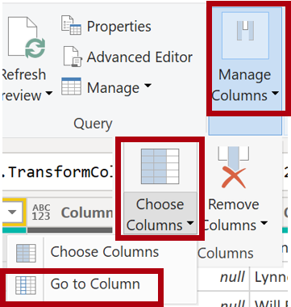

```
lab:
    title: 'Charger les données transformées dans Power BI Desktop'
    module: 'Nettoyer, transformer et charger des données dans Power BI'
```

# Charger les données transformées dans Power BI Desktop

## Présentation du lab

Dans ce lab, vous allez utiliser des techniques de nettoyage et de transformation de données pour commencer à structurer votre modèle de données. Vous allez ensuite appliquer les requêtes pour charger chaque table dans le modèle de données.

Dans ce lab, vous apprendrez à :

- Appliquer diverses transformations
- Charger des requêtes dans le modèle de données

**Ce lab devrait prendre environ 45 minutes.**

## Démarrage

Pour réaliser cet exercice, ouvrez un navigateur et entrez l'URL suivante pour télécharger le dossier zip :

`https://github.com/utopios/formationpowerbichefprojet/labs/02-load-data.zip`

Extrayez le dossier dans le dossier **C:\Users\Student\Downloads\02-load-data**.

Ouvrez le fichier **02-Starter-Sales Analysis.pbix**.

> ***Remarque** : Vous pouvez ignorer la connexion en sélectionnant **Annuler**. Fermez toutes les autres fenêtres d'information. Sélectionnez **Appliquer plus tard** si l'on vous demande d'appliquer les modifications.*

## Configurer la requête Salesperson

Dans cette tâche, vous allez utiliser Power Query Editor pour configurer la requête **Salesperson**.

> ***Important** : Lorsque vous devez renommer des colonnes, il est important de les renommer exactement comme décrit.*

1. Pour ouvrir la fenêtre **Power Query Editor**, dans l'onglet **Accueil** du ruban, dans le groupe **Requêtes**, sélectionnez l'icône **Transformer les données**.

     

1. Dans la fenêtre **Power Query Editor**, dans le volet **Requêtes**, sélectionnez la requête **DimEmployee**.

     

> **Remarque** : Si vous recevez un message d'avertissement demandant de spécifier comment se connecter, sélectionnez **Modifier les informations d'identification**, connectez-vous avec vos informations d'identification actuelles et sélectionnez **OK** pour utiliser une connexion non chiffrée.

1. Pour renommer la requête, dans le volet **Paramètres de requête** (situé à droite), dans la case **Nom**, remplacez le texte par **Salesperson**, puis appuyez sur **Entrée**. Vérifiez ensuite que le nom a été mis à jour dans le volet **Requêtes**.

    > *Le nom de la requête détermine le nom de la table dans le modèle. Il est recommandé de définir des noms concis et faciles à utiliser.*

1. Pour localiser une colonne spécifique, dans l'onglet **Accueil** du ruban, sélectionnez la flèche vers le bas de **Gérer les colonnes**, sélectionnez la flèche vers le bas de **Choisir des colonnes**, puis sélectionnez **Aller à la colonne**.

    > *Aller à la colonne est une fonctionnalité utile lorsque vous avez de nombreuses colonnes. Sinon, vous pouvez faire défiler horizontalement pour trouver des colonnes.*

     

1. Dans la fenêtre **Aller à la colonne**, pour trier la liste par nom de colonne, sélectionnez le bouton de tri **AZ**, puis sélectionnez **Name** et **SalesPersonFlag**. Cliquez sur **OK**.

     

1. Localisez la colonne **SalesPersonFlag**, puis filtrez la colonne pour sélectionner uniquement les commerciaux (**TRUE**), et cliquez sur **OK**.

1. Dans le volet **Paramètres de requête**, dans la liste **Étapes appliquées**, remarquez l'ajout de l'étape **Lignes filtrées**.

	> *Chaque transformation que vous créez ajoute une étape. Vous pouvez modifier ou supprimer des étapes, ou sélectionner une étape pour afficher un aperçu des résultats de la requête à ce stade de la transformation.*

     

1. Pour supprimer des colonnes, dans l'onglet **Accueil** du ruban, dans le groupe **Gérer les colonnes**, sélectionnez l'icône **Choisir des colonnes**.

1. Dans la fenêtre **Choisir des colonnes**, décochez **(Sélectionner toutes les colonnes)** pour désélectionner toutes les colonnes.

1. Pour inclure des colonnes, cochez les six colonnes suivantes :

    - EmployeeKey
    - EmployeeNationalIDAlternateKey
    - FirstName
    - LastName
    - Title
    - EmailAddress

1. Dans la liste **Étapes appliquées**, remarquez l'ajout d'une autre étape de requête.

     

1. Pour créer une colonne de nom unique, sélectionnez d'abord l'en-tête de colonne **FirstName**. Tout en maintenant la touche **Ctrl**, sélectionnez la colonne **LastName**.

     

1. Cliquez avec le bouton droit sur l'un des en-têtes de colonnes sélectionnées, puis dans le menu contextuel, sélectionnez **Fusionner les colonnes**.

	> *De nombreuses transformations peuvent être appliquées en cliquant avec le bouton droit sur l'en-tête de colonne, puis en les choisissant dans le menu contextuel. Notez que davantage de transformations sont disponibles dans le ruban.*

1. Dans la fenêtre **Fusionner les colonnes**, dans la liste déroulante **Séparateur**, sélectionnez **Espace**.

1. Dans la case **Nom de la nouvelle colonne**, remplacez le texte par **Salesperson**.

1. Pour renommer la colonne **EmployeeNationalIDAlternateKey**, double-cliquez sur l'en-tête de la colonne **EmployeeNationalIDAlternateKey** et remplacez le texte par **EmployeeID**, puis appuyez sur **Entrée**.

1. Utilisez les étapes précédentes pour renommer la colonne **EmailAddress** en **UPN**.

	> *UPN est un acronyme pour User Principal Name (nom principal de l'utilisateur).*

**En bas à gauche, dans la barre de statut, vérifiez que la requête a 5 colonnes et 18 lignes.**

## **Configurer la requête SalespersonRegion**

Dans cette tâche, vous allez configurer la requête **SalespersonRegion**.

1. Dans le volet **Requêtes**, sélectionnez la requête **DimEmployeeSalesTerritory**.

1. Dans le volet **Paramètres de requête**, renommez la requête en **SalespersonRegion**.

1. Pour supprimer les deux dernières colonnes, sélectionnez d'abord l'en-tête de colonne **DimEmployee**.

1. Tout en maintenant la touche **Ctrl**, sélectionnez la colonne **DimSalesTerritory**.

1. Cliquez avec le bouton droit sur l'un des en-têtes de colonnes sélectionnées, puis dans le menu contextuel, sélectionnez **Supprimer les colonnes**.

**Dans la barre de statut, vérifiez que la requête a 2 colonnes et 39 lignes.**

## Configurer la requête Product

Dans cette tâche, vous allez configurer la requête **Product**.

> ***Important** : Lorsque des instructions détaillées ont déjà été fournies, les étapes du lab seront plus concises. Si vous avez besoin des instructions détaillées, vous pouvez vous référer aux étapes des tâches précédentes.*

1. Sélectionnez la requête **DimProduct** et renommez la requête en **Product**.

1. Localisez la colonne **FinishedGoodsFlag**, puis filtrez la colonne pour obtenir les produits finis (c'est-à-dire TRUE).

1. Supprimez toutes les colonnes, **sauf** les suivantes :

    - ProductKey
    - EnglishProductName
    - StandardCost
    - Color
    - DimProductSubcategory

1. Remarquez que la colonne **DimProductSubcategory** représente une table liée (elle contient des liens **Valeur**).

1. Dans l'en-tête de la colonne **DimProductSubcategory**, à droite du nom de la colonne, sélectionnez le bouton d'expansion.

    

1. Affichez la liste complète des colonnes, puis cochez la case **Sélectionner toutes les colonnes** pour désélectionner toutes les colonnes.

